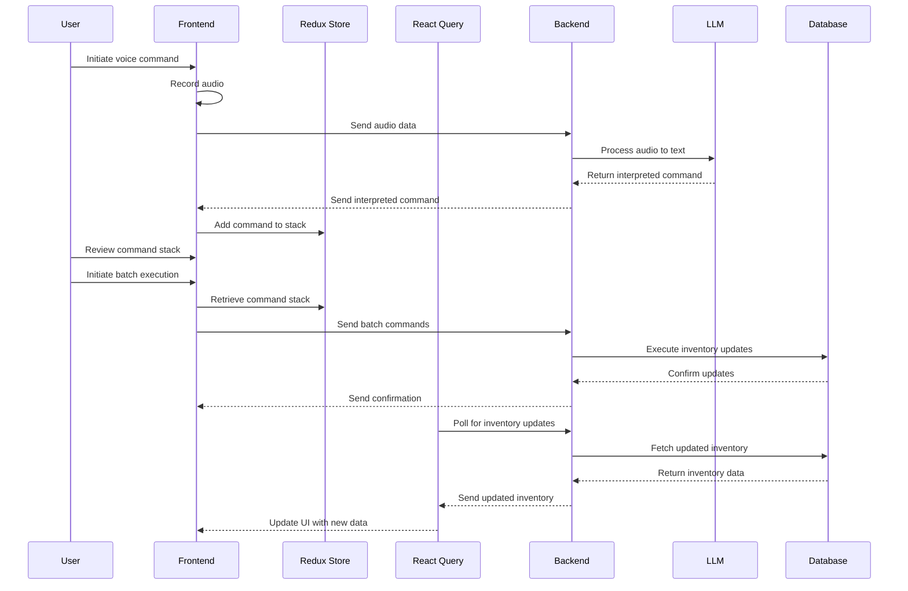

# Detailed Voice-Controlled Inventory Management System Summary

## Project Overview

- Developing a web-based inventory management system with voice control capabilities
- Target: Multi-user environment with real-time inventory updates
- Core functionality: Voice input for inventory commands, command review, and batch execution

## Tech Stack

1. Frontend:
   - React SPA using Vite
   - Redux Toolkit for client-side state management
   - React Query for server-state management and data fetching
2. Backend:
   - Express.js server
3. Real-time Updates:
   - Initially using React Query's polling mechanism
   - Potential future integration of WebSockets for true real-time updates

## Key Features and Implementation Details

### 1. Voice Input System

- Implement using Web Speech API or similar for speech-to-text conversion
- Audio recording handled client-side, sent to backend for processing
- LLM (Language Learning Model) on the backend for interpreting voice commands
- Command structure: action (add/update), quantity, unit, item

### 2. Command Stack

- Managed by Redux Toolkit
- Store structure:
  ```javascript
  {
    commands: {
      stack: [
        {
          action: "add",
          quantity: 10,
          unit: "gallons",
          item: "whole milk",
          timestamp: "2023-08-23T10:00:00Z",
        },
        // ... more commands
      ];
    }
  }
  ```
- Allows for review, editing, and batch execution of commands

### 3. Inventory Tracking

- React Query hook (`useInventory`) for fetching and caching inventory data
- Polling interval set to 30 seconds for near real-time updates
- Inventory item structure:
  ```javascript
  {
    id: string,
    name: string,
    quantity: number,
    unit: string,
    lastUpdated: string // ISO timestamp
  }
  ```

### 4. Real-time Updates

- Initial implementation: React Query polling
- Considerations for future WebSocket implementation if needed for more immediate updates

### 5. Batch Execution

- Allow users to queue multiple commands for review before execution
- Implement as a Redux action that processes the entire command stack

## Project Structure (Frontend Focus)

```
frontend/
├── src/
│   ├── components/
│   │   ├── VoiceInput.jsx
│   │   ├── CommandStack.jsx
│   │   ├── InventoryList.jsx
│   │   └── BatchExecution.jsx
│   ├── pages/
│   │   ├── Home.jsx
│   │   └── Inventory.jsx
│   ├── services/
│   │   ├── api.js
│   │   └── audioRecording.js
│   ├── store/
│   │   ├── index.js
│   │   ├── commandSlice.js
│   │   └── authSlice.js
│   ├── hooks/
│   │   ├── useInventory.js
│   │   └── useVoiceCommands.js
│   ├── App.jsx
│   └── main.jsx
├── package.json
└── vite.config.js
```

## Detailed Component Descriptions

### VoiceInput Component

- Handles voice recording start/stop
- Dispatches recorded audio or transcribed text to Redux store
- UI: Toggle button for recording

### CommandStack Component

- Displays current stack of interpreted commands
- Allows for editing or deletion of individual commands
- UI: List view with edit/delete options

### InventoryList Component

- Displays current inventory items
- Uses React Query's `useInventory` hook for data fetching and updates
- UI: List view with real-time updates

### BatchExecution Component

- Provides interface to review and execute batched commands
- Triggers execution of command stack
- UI: Review list and confirmation button

## Redux Store Structure

```javascript
{
  commands: {
    stack: [/* command objects */]
  },
  auth: {
    isLoggedIn: boolean,
    user: {/* user details */}
  }
}
```

## React Query Implementation

### useInventory Hook

```javascript
export function useInventory() {
  return useQuery("inventory", fetchInventory, {
    refetchInterval: 30000, // 30 seconds
    // ... other options
  });
}
```

### Inventory Mutation

```javascript
const mutation = useMutation(updateInventoryItem, {
  onSuccess: () => {
    queryClient.invalidateQueries("inventory");
  },
});
```

## Backend Considerations

1. Endpoint for receiving and processing audio/text commands
2. LLM integration for interpreting natural language commands
3. CRUD operations for inventory management
4. Authentication and authorization for multi-user support

## Next Steps and Implementation Plan

1. Set up project with Vite and install necessary dependencies
2. Implement Redux store with commandSlice and authSlice
3. Create React Query client and basic hooks (useInventory)
4. Develop core components (VoiceInput, InventoryList)
5. Implement audio recording and sending to backend
6. Develop backend API for command processing and inventory management
7. Integrate LLM for command interpretation (backend)
8. Implement BatchExecution functionality
9. Add error handling, loading states, and optimizations
10. Conduct testing for voice input accuracy and real-time update performance

## Future Considerations

- Scaling strategy for handling increased user load
- Performance optimization for large inventories
- Advanced voice command features (e.g., compound commands, undo/redo)
- Integration with other systems (e.g., order management, supplier databases)
- Mobile app development for on-the-go inventory management

## Potential Challenges

1. Accuracy of voice recognition and command interpretation
2. Handling network issues and offline functionality
3. Ensuring data consistency with multiple users
4. Balancing real-time updates with server load and mobile data usage

This detailed summary covers the core aspects of the project, including technical decisions, implementation details, and future considerations. It should provide the next AI instance with a comprehensive understanding of the project's current state and planned direction.

## System Flow



This diagram illustrates the flow of data and interactions between different parts of the system, from voice input to inventory updates.

## Additional Details and Considerations

1. Error Handling and Resilience:

   - Implement robust error handling for voice recognition failures
   - Design fallback mechanisms for when LLM interpretation is unclear
   - Handle network interruptions gracefully, possibly with offline mode support

2. Performance Optimization:

   - Implement debouncing for voice input to prevent excessive processing
   - Use memoization in React components to optimize renders
   - Consider implementing virtual scrolling for large inventory lists

3. Security Considerations:

   - Implement proper authentication and authorization mechanisms
   - Ensure secure transmission of audio data and commands
   - Regularly audit and update dependencies to patch vulnerabilities

4. Accessibility:

   - Provide alternative input methods for users who cannot use voice commands
   - Ensure the UI is screen reader friendly
   - Implement keyboard navigation for all features

5. Internationalization:

   - Plan for multi-language support in both voice recognition and UI
   - Consider cultural differences in inventory management practices

6. Data Management:

   - Implement data validation on both client and server side
   - Design a robust data backup and recovery system
   - Consider data archiving strategies for historical inventory data

7. User Experience Enhancements:

   - Provide visual feedback during voice recording (e.g., audio waveform)
   - Implement undo/redo functionality for inventory changes
   - Add customizable hotkeys for frequent actions

8. Testing Strategy:

   - Unit tests for Redux reducers and React Query hooks
   - Integration tests for voice input and command interpretation
   - End-to-end tests simulating complete user workflows
   - Performance tests to ensure responsiveness with large inventories

9. Monitoring and Analytics:

   - Implement logging for voice commands and system actions
   - Set up error tracking and reporting (e.g., Sentry)
   - Add analytics to track feature usage and identify improvement areas

10. Scalability Considerations:

    - Design the backend to be horizontally scalable
    - Implement caching strategies (e.g., Redis) for frequently accessed data
    - Consider using a message queue (e.g., RabbitMQ) for processing voice commands

11. Development Workflow:

    - Set up a CI/CD pipeline for automated testing and deployment
    - Implement feature flags for gradual rollout of new features
    - Establish code review and documentation practices

12. Legal and Compliance:
    - Ensure compliance with data protection regulations (e.g., GDPR)
    - Implement necessary disclaimers for voice data collection and usage
    - Consider industry-specific compliance requirements for inventory management

These additional details cover various aspects of the system that are crucial for a robust, scalable, and user-friendly application. They address important concerns across development, operations, user experience, and business considerations.
