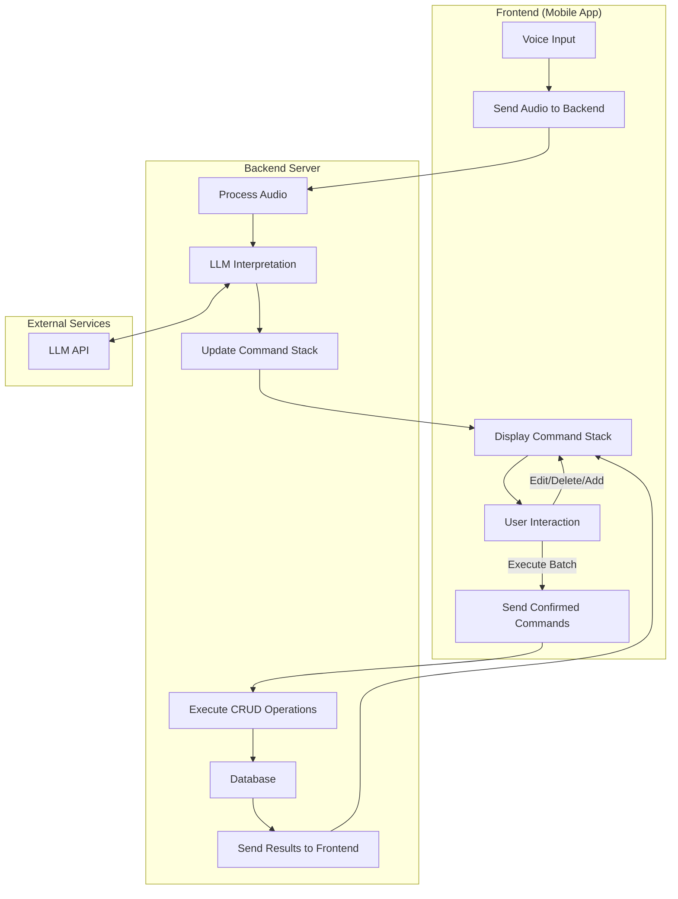

```mermaid
graph TD
    subgraph "Frontend (Mobile App)"
        A[Voice Input] --> B[Send Audio to Backend]
        F[Display Command Stack] --> G[User Interaction]
        G -->|Edit/Delete/Add| F
        G -->|Execute Batch| H[Send Confirmed Commands]
    end

    subgraph "Backend Server"
        C[Process Audio] --> D[LLM Interpretation]
        D --> E[Update Command Stack]
        E --> F
        H --> I[Execute CRUD Operations]
        I --> J[Database]
        J --> K[Send Results to Frontend]
    end

    B --> C
    K --> F

    subgraph "External Services"
        L[LLM API]
    end

    D <--> L
```
